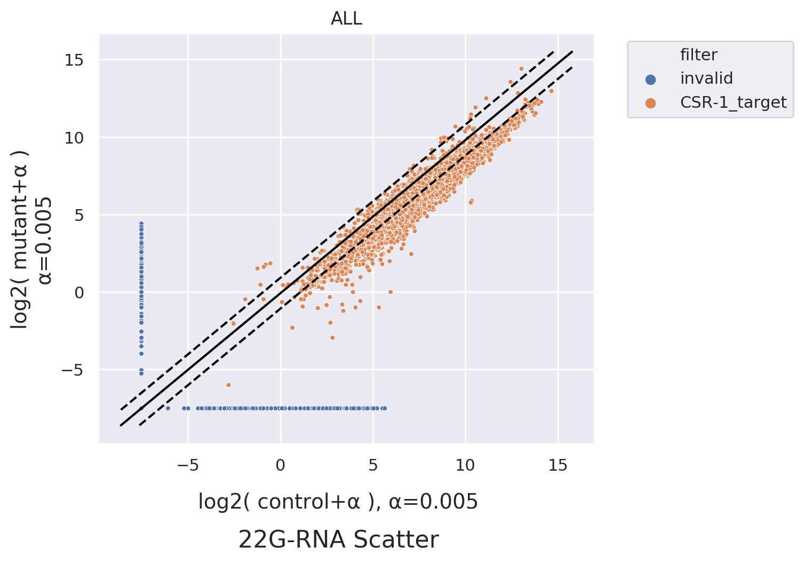
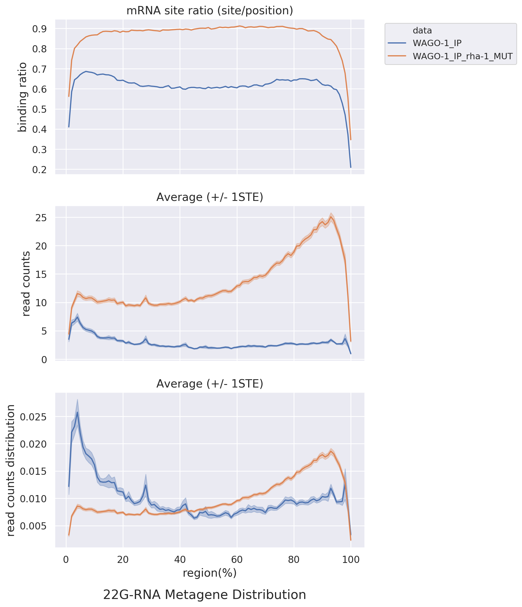
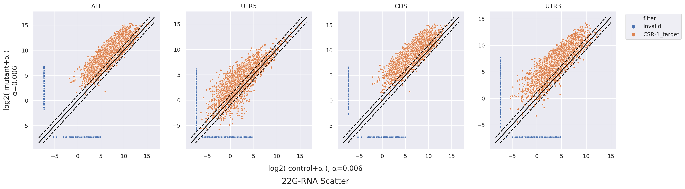
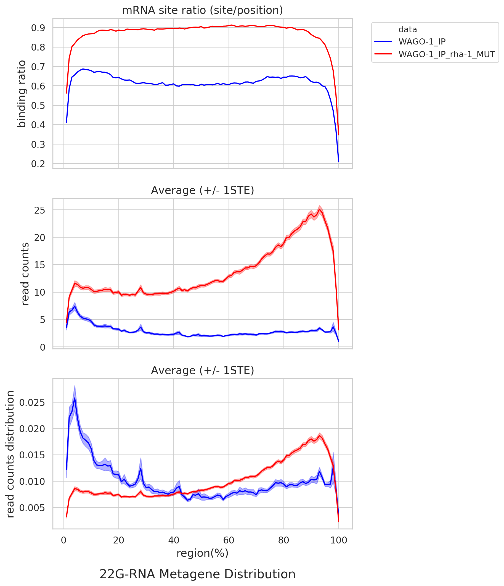
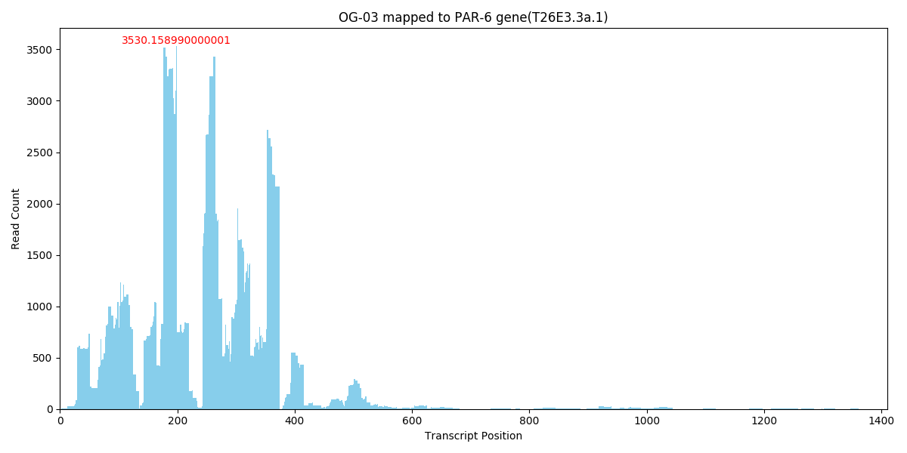

## Data Download

Please download the required normalization data files from the following links:

- [RPM normalization data](http://nas.csblab.ee.ncku.edu.tw:32200/sharing/pMyHlDuA8)  
- [miRNA abundance normalization data](http://nas.csblab.ee.ncku.edu.tw:32200/sharing/IaGDgQxT3)  

After downloading, place the files into the following directory: 
`RHA-1_generate_fig/input/`

---

## Required Packages and System Dependencies

This program requires specific Python packages and system-level dependencies to run correctly. Please ensure that all versions match those listed below to maintain compatibility.

### Python Package Requirements

Install the following Python packages with the specified versions:

```bash
pip install \
  numpy==1.18.5 \
  pandas==0.24.2 \
  matplotlib==3.0.3 \
  seaborn==0.9.1 \
  pysam==0.20.0 \
  oyaml==1.0 \
  scipy==1.4.1 \
  statannotations==0.6.0 \
  rpy2==3.0.5 \
  tzlocal==2.1 \
  uwsgi==2.0.24 \
  cutadapt==3.7 \
  PyYAML==5.3.1
```

### System-Level Requirements
Python version: `3.5.2`
System package: cutadapt version `2.9`
```bash
apt install cutadapt  
```

---
## Executing Program
After building the virtual environment, and put csv files in `RHA-1_generate_fig/input/`
```bash
cd path-to-RHA-1_generate_fig/
bash run_generate_fig.sh
```

---
## Working with `.fastq` Files
If you have .fastq.gz files, please include the following samples in the input directory: 
`OG-02, OG-06, OG-10, OG-14, OG-04, OG-08, OG-12, OG-16, OG-03, OG-07` `RHA-1_generate_fig/input/` 

Rename them appropriately, for example: `OG-01.fastq.gz`

Then, modify the `RHA-1_generate_fig/run_generate_fig.sh` script by changing: 
```diff
- preprocess=False
+ preprocess=True
```

---
## Example Outputs
This folder contains example images generated by the pipeline.  
To regenerate them, run `bash run_generate_fig.sh` with appropriate input data.









---
## External Code Reference

This project includes adapted code from the [sRNAanalyst](https://github.com/RyanCCJ/sRNAanalyst) project by [RyanCCJ](https://github.com/RyanCCJ), specifically for small RNA analysis functionalities.

Only selected scripts or modules have been retained under `RHA-1_generate_fig/sRNAanalyst/`, and modifications may have been made for compatibility or customization.

> Original repository: https://github.com/RyanCCJ/sRNAanalyst  
> License: MIT License – original license and attribution have been preserved where applicable.
