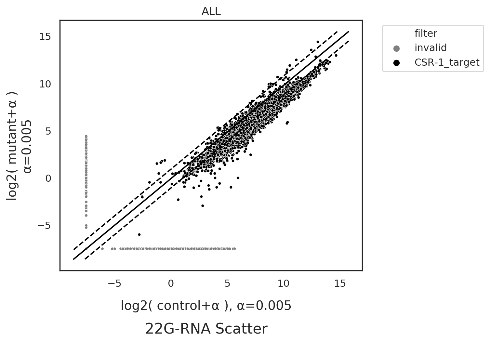
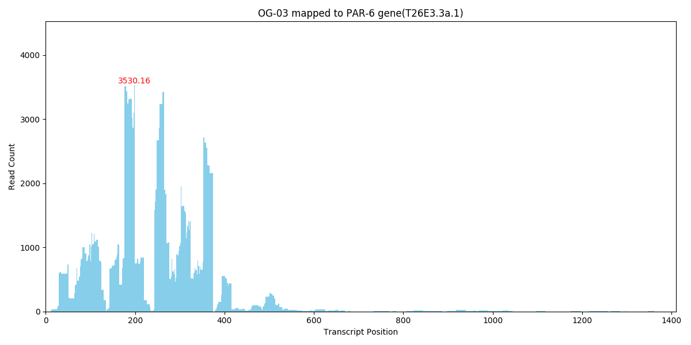

## Data Preprocessing
1. Use `cutadapt` to trim adapter sequences and discard reads containing ambiguous 'N' bases (`cutadapt --max-n 0 -a AGATCGGAAGAGCACACGTCT`)
2. Collapse duplicate reads to reduce redundancy, calculate the read count for each unique read and output the result in FASTA format
3. calculating normalization factor
    - miRNA abundance: Calculate the read count of perfectly mapped reads to known miRNAs(using `bowtie2`), then normalize `normalization factor = (mapped_miRNA_read_count) / 10^6`
    - RPM: Sum up the read counts of all collapsed reads, `normalization_factor = (total_read_count) / 10^6`
4. Filter reads that start with a 'G', have a length of 22–23 nucleotides and map filtered reads to the mRNA reference using bowtie2 in perfect-match mode (`bowtie2 -a --score-min C,0,0 --norc --no-unal --no-hd`).
5. output .csv file

---

## Data Download

Please download the required normalization data files from the following links:

- [RPM normalization data](http://nas.csblab.ee.ncku.edu.tw:32200/sharing/pMyHlDuA8)  
- [miRNA abundance normalization data](http://nas.csblab.ee.ncku.edu.tw:32200/sharing/IaGDgQxT3)  

After downloading, place the files into the following directory: 
`RHA-1_generate_fig/input/`

Example:
If you only need to analyze data normalized using RPM, you just need to download the CSV file from [this link](http://nas.csblab.ee.ncku.edu.tw:32200/sharing/pMyHlDuA8) and place it in the input folder. There's no need to download the other CSV file from the second link.

---

## Required Packages and System Dependencies

This program requires specific Python packages and system-level dependencies to run correctly. Please ensure that all versions match those listed below to maintain compatibility.

### Python Package Requirements

Install the following Python packages with the specified versions:

```bash
pip install \
  numpy==1.18.5 \
  pandas==0.24.2 \
  matplotlib==3.0.3 \
  seaborn==0.9.1 \
  pysam==0.20.0 \
  oyaml==1.0 \
  scipy==1.4.1 \
  statannotations==0.6.0 \
  rpy2==3.0.5 \
  tzlocal==2.1 \
  uwsgi==2.0.24 \
  cutadapt==3.7 \
  PyYAML==5.3.1
```

### System-Level Requirements
- Python version: `3.5.2`
- System package: 
    - cutadapt version `2.9`
```bash
apt install cutadapt  
```
    - bowtie2 version `2.4.1`
```bash
wget https://sourceforge.net/projects/bowtie-bio/files/bowtie2/2.5.3/bowtie2-2.5.3-linux-x86_64.zip/download -O Bowtie2.zip
unzip -j Bowtie2.zip -d Bowtie2
mv Bowtie2 sRNAanalyst/src/
rm Bowtie2.zip
export PATH=sRNAanalyst/src/Bowtie2:$PATH
```

---
## Executing Program
After building the virtual environment, and put csv files in `RHA-1_generate_fig/input/`
```bash
cd path-to-RHA-1_generate_fig/
bash run_generate_fig.sh
```

After executing bash `run_generate_fig.sh`, all figures from the paper will be saved in the `RHA-1_generate_fig/output/` directory.

---
## Working with `.fastq` Files
If you have .fastq.gz files, please include the following samples in the input directory: 
`OG-02, OG-06, OG-10, OG-14, OG-04, OG-08, OG-12, OG-16, OG-03, OG-07` `RHA-1_generate_fig/input/` 

Rename them appropriately, for example: `OG-01.fastq.gz`

Then, modify the `RHA-1_generate_fig/run_generate_fig.sh` script by changing: 
```diff
- preprocess=False
+ preprocess=True
```

Users can customize the normalization method by modifying the following line in the script `RHA-1_generate_fig/run_generate_fig.sh`:
```
# [ "RPM" / "miRNA_abu" ]
norm_method="RPM"
```

---
## Example Outputs
This folder contains example images generated by the pipeline.  
To regenerate them, run `bash run_generate_fig.sh` with appropriate input data.

- The upper image(`fig_e1.png`) corresponds to the left scatter plot of Figure E, and the bottom image(`fig_e2.png`) corresponds to the right scatter plot of Figure E.



- The middle plot in this image(`fig_f.png`) represents Figure F in the paper.


- The upper image(`fig_g1.png`) corresponds to the left scatter plot of Figure G, and the bottom image(`fig_g2.png`) corresponds to the right scatter plot of Figure G.


- The middle plot in this image(`fig_h.png`) represents Figure H in the paper.


- This is the bedGraph(`OG-03_22G.png`) of OG-03. After running `run_generate_fig.sh`, bedGraph files for OG-03, OG-04, OG-07, OG-08, OG-12, and OG-16 are generated and saved in the `output` folder.


---
## External Code Reference

This project includes adapted code from the [sRNAanalyst](https://github.com/RyanCCJ/sRNAanalyst) project by [RyanCCJ](https://github.com/RyanCCJ), specifically for small RNA analysis functionalities.

Only selected scripts or modules have been retained under `RHA-1_generate_fig/sRNAanalyst/`, and modifications may have been made for compatibility or customization.

> Original repository: https://github.com/RyanCCJ/sRNAanalyst  
> License: MIT License – original license and attribution have been preserved where applicable.
