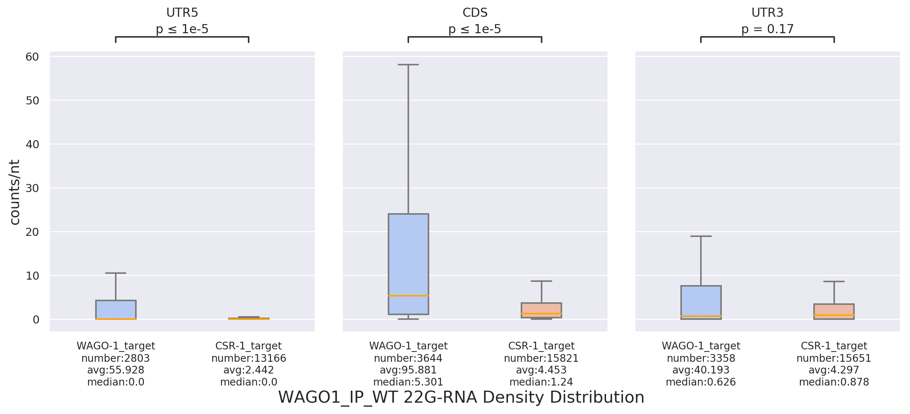
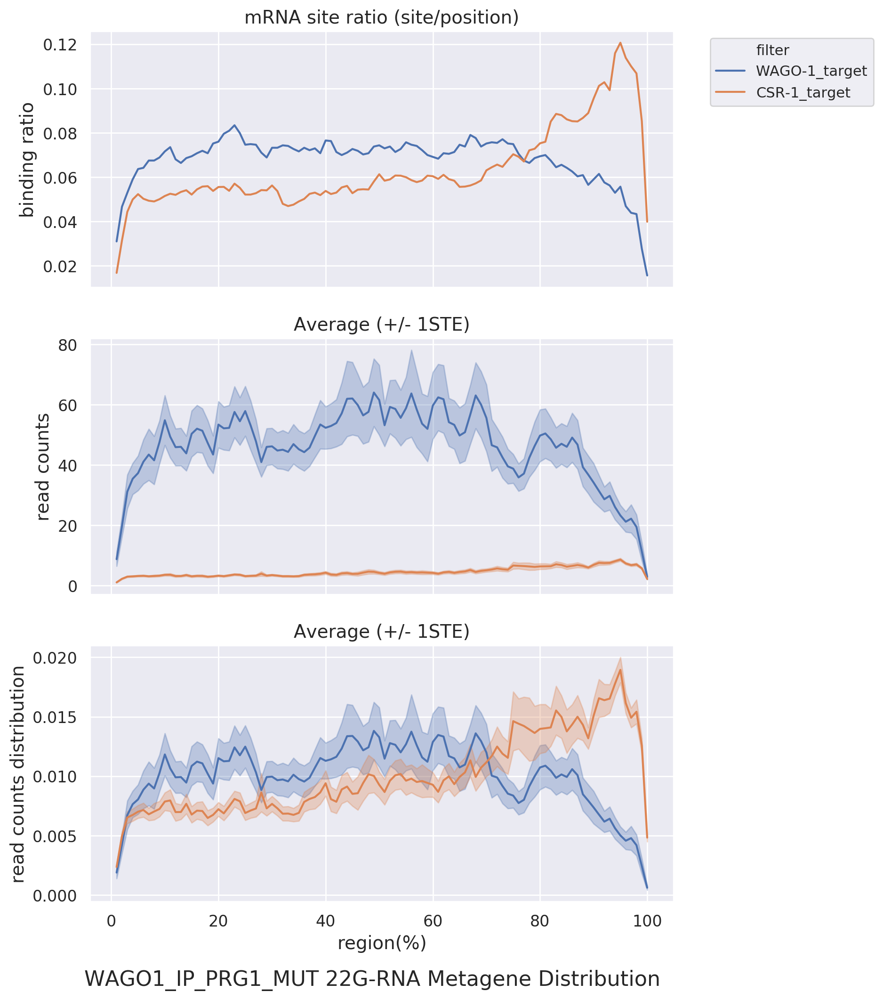
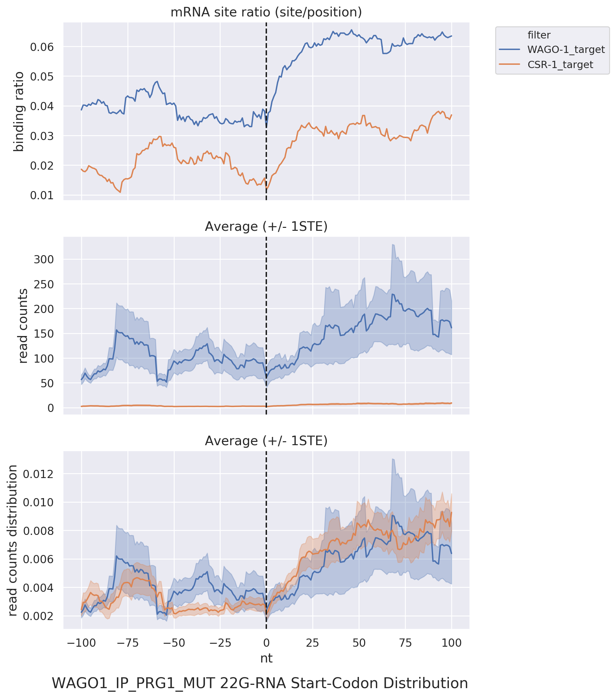
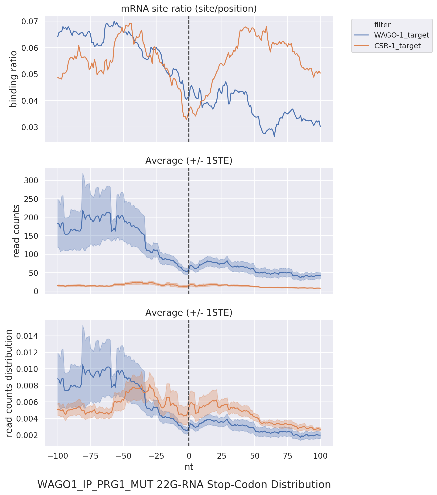
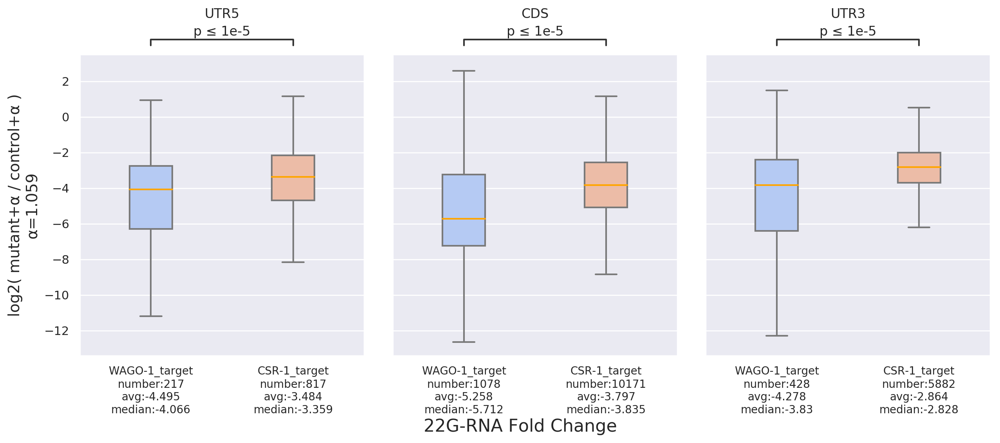
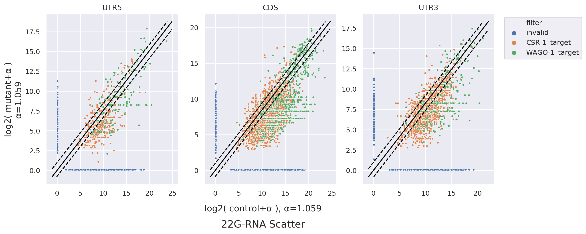

# sRNAanalyst
A Comprehensive Tool for In-depth Analysis of sRNA-seq Data across Conditions and Target Genes.

## Main Features
**1. Universal Preprocessing Tool**  
- Provides a versatile preprocessing tool that seamlessly integrates with various utilities such as Cutadapt and Bowtie, enabling the construction of customized preprocessing workflows.

**2. Downstream Analysis Tool**  
- Facilitates transcriptome-wide examination of NGS sequences under specific gene lists using several downstream analysis tools.

> [!NOTE]
> This version incorporates numerous improvements in performance and architecture, including the addition of a new preprocessing workflow. For information on the previous version and related research paper, please refer to the [RDT](https://github.com/RyanCCJ/RDT) project.

## Downstream Tools
1. **Density Distribution:** Enables observation of distribution across different regions, facilitating the comparative analysis of results across different conditions and target genes.  
   

2. **Metagene Distribution:** Allows the overlay of target genes for an overview of their collective distribution patterns.  
   

3. **Position Distribution:** Facilitates observation of distribution around specific positions, currently including boundaries and start/stop codons. 
   <table>
   <tr>
      <td valign="top"></td>
      <td valign="top"></td>
   </tr>
   </table>

4. **Fold-change Plot:** Permits the examination of the magnitude of changes between two conditions within different regions.  
   

5. **Scatter Plot:** Enables the observation of the relative distribution of two conditions within different regions.  
   

## Getting Start
```sh
# download this project
git clone https://github.com/RyanCCJ/sRNAanalyst.git
cd sRNAanalyst

# an example of worm (C.elegans) 22G-RNAs is provided
cd example/script/

# perform preprocessing and generate various intermediate files
sh 22G_preprocess.sh

# perform downstream analysis and generate various analysis graphics
sh 22G_analyze.sh
```

It is recommended to independently compose a suitable workflow for applying preprocessing tool and to use or import the analysis tool accordingly. The two main programs are located in the `src/` directory, namely `srna_preprocess.py` and `srna_analysis.py`. The analysis tool will additionally require two additional modules: `utility.py` and `computation.py`. For detailed usage instructions, please refer to the [doc]().

> [!NOTE]
> The examples in this project require approximately **530MB** of disk space. Please ensure you have sufficient space for operations. Alternatively, you can download only the source code and configuration files.

## Web Tool

If you prefer a quick trial, you can explore our [web tool](https://cosbi7.ee.ncku.edu.tw/sRNAanalyst/).

1. **Preprocess Page:**
- Provides a user-friendly workflow for customizing preprocessing steps.
- Users can utilize our universal tool to achieve specific effects.

2. **Analysis Page:**
- Integrates various downstream analysis tools.
- Users can input experimental or literature data, or selectively input a target list of interest for further analysis.

3. **Database Page:**
- Includes literature data such as NGS raw-read, reference, and a portion of the nematode target list for reference.

> [!NOTE]
> All uploaded data and analysis results will be retained for only **3 days**. Please make sure to record your job ID. If you have additional requirements, consider exploring our [Docker version](https://github.com/RyanCCJ/sRNAanalyst-docker).

## Documentation
To see full documentation, please check this project's [wiki](https://github.com/RyanCCJ/sRNAanalyst/wiki).

## Requirements
Running sRNAanalyst require Linux or MacOS. Other Unix environments will probably work but have not been tested. Windows users can use [Windows Subsystem for Linux](https://docs.microsoft.com/en-us/windows/wsl/install-win10).

- Python >= 3.5
- numpy >= 1.12
- seaborn >= 0.9, < 0.12
- matplotlib >= 2.2
- pandas >= 0.23, < 2.0
- pysam >= 0.20
- scipy >= 1.1
- tqdm >= 4.0
- oyaml >= 1.0
- cutadapt >= 2.10
- rpy2 >= 3.0.5

### EdgeR statistical test
- R >= 4.3
- BiocManager >= 1.30.22
- edgeR >= 4.0.2

### Box-plot statistical test
If Python >= 3.6
- statannotations >= 0.6.0

If Python >= 3.5, < 3.6
- statannot = 0.2.3  
> [!IMPORTANT]
> There are some bugs in the [statannot](https://github.com/webermarcolivier/statannot) package. Before usage, please refer to the [doc](https://github.com/RyanCCJ/sRNAanalyst/wiki/1.--Install-and-Prepare-Data#important-issue) for more details.

## LICENSE
Please refer to our [MIT license](https://github.com/RyanCCJ/sRNAanalyst/blob/master/LICENSE).
